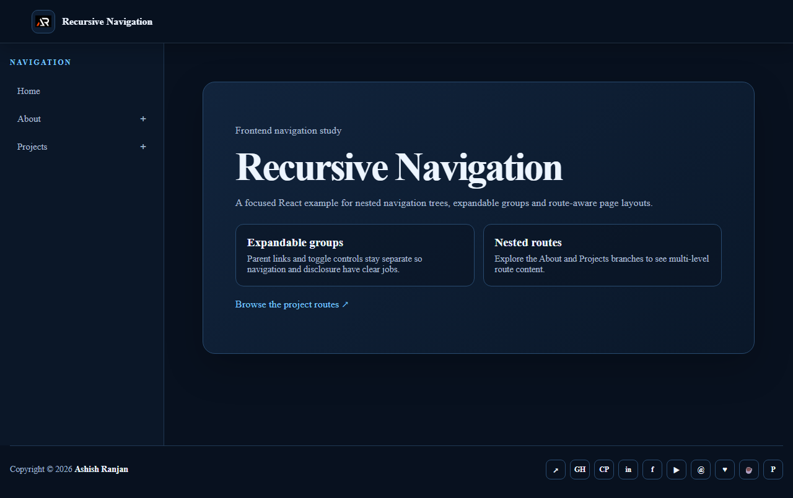

# Recursive Navigation

A responsive React demonstration of expandable navigation groups, active routes and nested pages. The project shows how a recursive-style menu can stay easy to scan on desktop and mobile.

## Features

- Fixed branded header with a mobile navigation drawer
- Expandable About and Projects groups with independent toggle controls
- Nested React Router routes with active link states
- Route changes scroll the content area to the top
- Responsive page cards, icon-only footer links and dynamic copyright

## Tech Stack

React, JavaScript, React Router, Create React App, Sass and CSS Modules.

## Run locally

```bash
npm install
npm start
```

## Build and deploy

```bash
npm run build
npm run deploy
```

Live URL: [https://a2rp.github.io/react-recursive-nav-menu/](https://a2rp.github.io/react-recursive-nav-menu/)

## Preview



## Links

- [Portfolio](https://www.ashishranjan.net/)
- [GitHub](https://github.com/a2rp)
- [CodePen](https://codepen.io/ash1198)
- [LinkedIn](https://www.linkedin.com/in/aashishranjan)
- [Facebook](https://www.facebook.com/theash.ashish/)
- [YouTube](https://www.youtube.com/@ashishranjan-ashz?sub_confirmation=1)
- [Email](mailto:ash.ranjan09@gmail.com)

## Support

- [Support](https://a2rp-donation-page.netlify.app/)
- [Buy Me a Coffee](https://buymeacoffee.com/a2rp)
- [Patreon](https://patreon.com/a2rp)